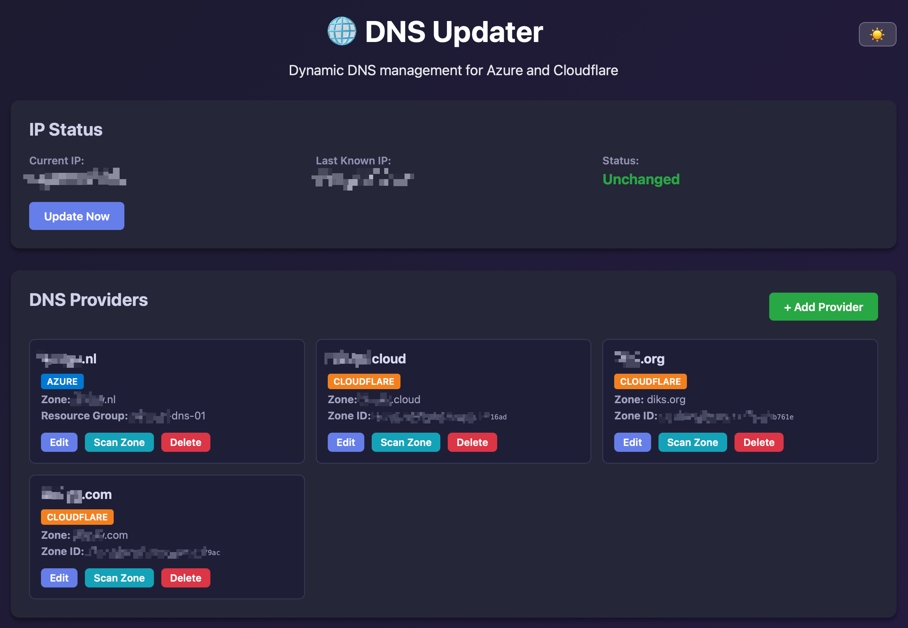
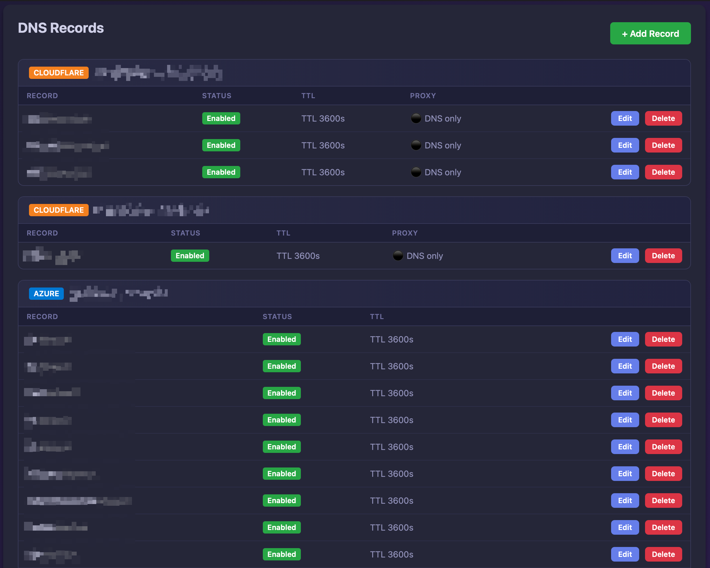
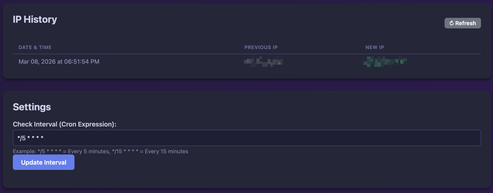

# DNS Updater

A dynamic DNS updater with a web GUI that automatically updates DNS records in Azure DNS and Cloudflare when your public IP address changes. Perfect for home servers and self-hosted applications.

## Features

- 🌐 **Multi-Provider Support**: Works with both Azure DNS and Cloudflare
- 🖥️ **Web GUI**: Easy-to-use interface for managing DNS records
- 🔄 **Automatic Updates**: Monitors your public IP and updates DNS records only when it changes
- 🔍 **Zone Scanner**: Scan an existing DNS zone and import A records in one click
- 📜 **IP History**: Tracks every IP change with date and time
- 📋 **Log Viewer**: Dedicated logs page with search, level filters, and auto-refresh
- 🌙 **Dark Mode**: Toggle between light and dark themes (preference persisted in browser)
- 🐳 **Docker-Ready**: Runs as a containerized application
- 💾 **Persistent Settings**: Configuration survives container restarts
- ⏰ **Configurable Schedule**: Set your own check interval using cron expressions
- 🔒 **Secure**: Credentials stored locally, never sent to the browser

## Quick Start

1. **Build and start the container:**
   ```bash
   cd dns-updater
   docker-compose up -d
   ```

2. **Access the web GUI:**
   Open your browser to http://localhost:3010

3. **Configure your DNS provider** (see setup sections below)

4. **Add DNS records** to track and update

## Screenshots







## Azure DNS Setup

### Prerequisites

You need an Azure Service Principal with permissions to manage your DNS zone.

### Creating a Service Principal

1. **Login to Azure CLI:**
   ```bash
   az login
   ```

2. **Create a Service Principal:**
   ```bash
   az ad sp create-for-rbac --name "dns-updater" --role "DNS Zone Contributor" --scopes /subscriptions/{subscription-id}/resourceGroups/{resource-group}/providers/Microsoft.Network/dnszones/{zone-name}
   ```

   This will output:
   ```json
   {
     "appId": "xxxxxxxx-xxxx-xxxx-xxxx-xxxxxxxxxxxx",
     "displayName": "dns-updater",
     "password": "your-client-secret",
     "tenant": "xxxxxxxx-xxxx-xxxx-xxxx-xxxxxxxxxxxx"
   }
   ```

3. **Note these values:**
   - `appId` = Client ID
   - `password` = Client Secret
   - `tenant` = Tenant ID
   - You'll also need your Subscription ID and Resource Group name

### Adding Azure DNS Provider in the Web GUI

1. Click "Add Provider"
2. Fill in the form:
   - **Provider Name**: A friendly name (e.g., "My Azure DNS")
   - **Provider Type**: Select "Azure DNS"
   - **DNS Zone Name**: Your domain (e.g., "example.com")
   - **Subscription ID**: From Azure portal or `az account show`
   - **Tenant ID**: From Service Principal creation
   - **Client ID**: The `appId` from Service Principal creation
   - **Client Secret**: The `password` from Service Principal creation
   - **Resource Group**: The resource group containing your DNS zone

## Cloudflare Setup

### Prerequisites

You need a Cloudflare API Token with DNS edit permissions.

### Creating an API Token

1. **Login to Cloudflare Dashboard**

2. **Navigate to:**
   - Profile → API Tokens → Create Token

3. **Select "Edit zone DNS" template** or create custom token with:
   - Permissions: `Zone > DNS > Edit`
   - Zone Resources: `Include > Specific zone > [Your Domain]`

4. **Copy the API Token** (you won't see it again!)

### Adding Cloudflare Provider in the Web GUI

1. Click "Add Provider"
2. Fill in the form:
   - **Provider Name**: A friendly name (e.g., "My Cloudflare")
   - **Provider Type**: Select "Cloudflare"
   - **DNS Zone Name**: Your domain (e.g., "example.com")
   - **Zone ID**: Found in the Cloudflare dashboard under **Websites → [domain] → Overview → API** (right sidebar)
   - **API Token**: The token you created

> **Note:** Each DNS zone needs its own provider entry with its own Zone ID. The Zone ID is required — the app does not auto-discover it, since scoped API tokens typically don't have permission to list all zones.

## Adding DNS Records

### Manually

1. Click "Add Record" in the DNS Records section
2. Fill in the form:
   - **Provider**: Select your configured provider
   - **Record Name**: Subdomain name (use `@` for root domain)
     - Examples: `home`, `vpn`, `server`, `@`
   - **TTL**: Time to live in seconds (default: 3600)
   - **Proxied**: (Cloudflare only) Enable Cloudflare proxy
   - **Enabled**: Check to enable automatic updates
3. Click "Save Record"

### Via Zone Scanner

The Zone Scanner reads all existing A records from a provider's zone and lets you import them:

1. In the **DNS Providers** section, click **Scan Zone** on a provider card
2. A list of all A records found in that zone is shown, with their current IP and TTL
3. Records already tracked are pre-checked and greyed out
4. Select any new records to import and click **Import Selected**

## Usage

### Manual Update

Click the **Update Now** button to immediately check your IP and update all enabled records, regardless of whether the IP has changed.

### Automatic Updates

The cron job calls the update function with `forceUpdate = false`, so DNS records are only written to the provider **if the public IP has actually changed** since the last check.

### IP History

Every time the IP changes, an entry is added to the **IP History** section (and persisted to `data/ip_history.json`), showing the previous IP, new IP, and the exact date and time of the change. Up to 500 entries are kept.

### Logs

Click the **📄 Logs** link in the top-right corner of the header to open the dedicated log viewer. It shows all server-side log output with:

- **Search** — filter by any text (e.g. `azure`, `cloudflare`, `error`, `IP changed`, a record name)
- **Level filters** — independently toggle INFO / WARN / ERROR
- **Tag badges** — `[azure]`, `[cloudflare]`, and `[system]` prefixes on every log line
- **Auto-refresh** every 15 seconds (can be toggled off)

### Dark Mode

Click the 🌙 button in the top-right corner of the header to switch to dark mode. Click ☀️ to switch back. The preference is saved in your browser's `localStorage`.

### Changing Check Interval

Edit the cron expression in the Settings section:

- `*/5 * * * *` - Every 5 minutes (default)
- `*/15 * * * *` - Every 15 minutes
- `0 * * * *` - Every hour
- `0 */6 * * *` - Every 6 hours

[Learn more about cron expressions](https://crontab.guru/)

## Configuration Persistence

All settings are stored in the `./data` directory on the host machine, which is mounted to `/data` in the container. This ensures your configuration persists across container restarts and updates.

### Data Directory Structure
```
data/
├── config.json       # Providers and records configuration
├── last_ip.txt       # Last known public IP address
└── ip_history.json   # Log of all IP changes (timestamp, old IP, new IP)
```

### Backup

To backup your configuration:
```bash
cp -r data/ data-backup/
```

### Restore

To restore from backup:
```bash
cp -r data-backup/* data/
docker-compose restart
```

## Docker Commands

### Start the service
```bash
docker-compose up -d
```

### Stop the service
```bash
docker-compose down
```

### View logs
```bash
docker-compose logs -f
```

### Rebuild after code changes
```bash
docker-compose up -d --build
```

### Remove everything (including data)
```bash
docker-compose down -v
rm -rf data/
```

## Port Configuration

The default port is 3000. To change it:

1. Edit `docker-compose.yml`:
   ```yaml
   ports:
     - "8080:3000"  # Change 8080 to your desired port
   ```

2. Restart:
   ```bash
   docker-compose up -d
   ```

## Troubleshooting

### DNS records not updating

1. **Check the log viewer:**
   Click **📄 Logs** in the header, or run:
   ```bash
   docker-compose logs -f
   ```

2. **Verify credentials:**
   - Azure: Test with `az login --service-principal`
   - Cloudflare: Test API token in their dashboard

3. **Check IP status:**
   - The web GUI shows current IP and last known IP
   - Use the **📄 Logs** page to see detailed update results per record

### Can't access web GUI

1. **Check container is running:**
   ```bash
   docker-compose ps
   ```

2. **Check port availability:**
   ```bash
   netstat -tulpn | grep 3000
   ```

3. **Check firewall rules**

### Configuration lost after restart

1. **Verify volume mount:**
   ```bash
   docker-compose config
   ```

2. **Check data directory permissions:**
   ```bash
   ls -la data/
   ```

## Security Notes

- 🔒 Credentials are stored locally in the container's data volume
- 🚫 Credentials are never sent to the browser (shown as ***)
- 🔐 Use read-only API tokens when possible
- 🛡️ Run behind a reverse proxy with HTTPS for production use
- 🔑 Consider using Azure Key Vault or similar for production secrets

## API Endpoints

The application exposes a REST API:

- `GET /api/config` - Get current configuration (credentials masked)
- `GET /api/status` - Get current IP status
- `GET /api/ip-history` - Get IP change history
- `GET /api/logs` - Get in-memory log buffer (supports `?limit=N`)
- `POST /api/providers` - Add/update DNS provider
- `DELETE /api/providers/:id` - Delete provider
- `GET /api/providers/:id/scan` - Scan a provider's zone for existing A records
- `POST /api/records` - Add/update DNS record
- `DELETE /api/records/:id` - Delete record (supports `?deleteFromProvider=true`)
- `POST /api/update` - Trigger manual update
- `POST /api/interval` - Update check interval

## Example Use Cases

### Home Server
Keep your home server accessible via a friendly domain name even when your ISP changes your IP address.

### VPN Server
Automatically update your VPN server's DNS record so clients can always connect.

### Self-Hosted Services
Run multiple services behind different subdomains, all automatically updated.

### Multi-Cloud Setup
Use Azure DNS for some domains and Cloudflare for others, all managed from one place.

## License

MIT

## Contributing

Contributions welcome! Please feel free to submit issues and pull requests.
